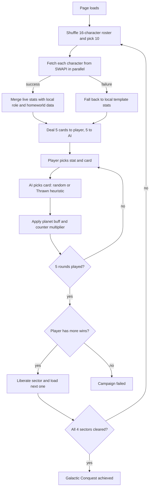

<div align="center">

# ⚔️ Galactic Conquest

### A Star Wars card-battle campaign powered by live SWAPI data

*Liberate three worlds. Outwit the Empire. Face Palpatine on the Death Star.*


https://github.com/user-attachments/assets/8b035023-2880-49e3-ba46-1a045a06c37d


</div>

---

## 📖 About

**Galactic Conquest** is a browser-based, single-player strategy card game set in the Star Wars universe. You command a squad of five iconic characters across a four-stage campaign (Tatooine → Hoth → Coruscant → the Death Star), picking a stat each round and clashing your cards against an Imperial AI.

Character stats (height, mass, birth year, and the number of films, vehicles and starships) are pulled **live from the [Star Wars API (SWAPI)](https://swapi.tech/)** every time a sector begins. On top of that raw data sits a custom rules layer: homeworld bonuses, a role-based counter system, a one-time Jedi ability, and two AI difficulty levels.

It is built with **plain HTML, CSS and JavaScript**: no frameworks, no build step, no npm install.

## 🎮 How to Play

1. **Choose your opponent.** Pick *Easy* (random AI) or *Thrawn* (tactical AI) on the title screen.
2. **Launch the campaign.** You get 5 cards, the Empire gets 5 hidden cards.
3. **Pick a stat** (Height, Mass, Films, Vehicles, Starships or Age).
4. **Click one of your cards** to send it into battle. The AI plays one of its own.
5. **Highest final power wins the round.** Ties are a stalemate and nobody scores.
6. **Win the sector** by scoring more round wins than the AI over 5 rounds, then move on to the next world.
7. **Clear all four sectors** to destroy the Death Star and win the campaign. Lose a sector and the rebellion falls.

### Power formula

```
final power = round( (stat value + planet bonus) × counter multiplier )
```

| Mechanic | Rule |
|---|---|
| 🌍 **Planet buff** | A card whose homeworld matches the current sector gets **+20** to its stat. |
| ⚔️ **Counter system** | The advantaged role gets a **×1.25** multiplier (see below). |
| 🧠 **Jedi Mind Trick** | Once per campaign, reveal which card the AI is about to play. |
| 🎂 **Age stat** | Measured in years BBY (Before the Battle of Yavin), so higher means older. |

### Counter triangle

| Attacker | Beats |
|---|---|
| **Jedi** | Blaster users (Bounty Hunter, Warrior, Smuggler, Rebel Leader) |
| **Blaster users** | Droids |
| **Droid** | Sith |
| **Sith** | Jedi |

### AI difficulty

- **Easy:** plays a random card from its hand.
- **Thrawn:** reads the stat you selected, then scores every card in its hand using `(stat + planet bonus) × average counter multiplier against your remaining hand`, and plays the highest-scoring card.

## 🧰 Tech Stack

| Technology | Used for |
|---|---|
| **HTML5** | Semantic page structure: intro overlay, battlefield board, battle modal, game-over modal. |
| **CSS3** | Starfield background (layered `radial-gradient`s), flexbox/grid layouts, `backdrop-filter` blur, `@keyframes` animations (lightsaber clash, fade-in, pulse), hover transforms, glow effects via `box-shadow` and `text-shadow`, role-coloured badges. |
| **Vanilla JavaScript (ES6+)** | All game logic: state management, DOM rendering from template literals, round resolution, campaign progression, AI. Uses arrow functions, `const`/`let`, destructuring-free simple modules, template strings and array methods. |
| **Fetch API** | Retrieves character data from SWAPI and the portrait dataset from GitHub. |
| **[SWAPI (swapi.tech)](https://swapi.tech/)** | Live source for each character's height, mass, birth year and film/vehicle/starship counts. |
| **[akabab/starwars-api](https://github.com/akabab/starwars-api)** | Dataset of character portrait URLs, keyed by the same IDs as SWAPI. |
| **Inline SVG (data URI)** | Generates an initials placeholder when a portrait fails to load, so a card never shows a broken image. |

## 🧠 How It Works



**Key design decisions**

- **Hybrid data model.** SWAPI supplies factual stats, but it knows nothing about game roles (Jedi, Sith, Droid…), lightsaber colours or portraits. A local `characterRoster` array adds those game-specific fields, and its stats double as an **offline fallback** if the API is unreachable.
- **Resilient loading.** Every SWAPI request goes through a small `get()` wrapper that catches network errors and returns `null`, so one failed request never blocks the game from starting.
- **Resilient images.** Portraits are looked up by SWAPI ID from a remote dataset. If a lookup or image load fails, an `onerror` handler swaps in a generated SVG placeholder.
- **Data-driven cards.** One `buildCardHtml()` function renders every card (hand, battle arena and winner spotlight), so the UI stays consistent.
- **Fair-play AI.** The Thrawn AI uses only information a player could also reason about (the chosen stat, homeworld bonus and role matchups), and the Jedi Mind Trick gives the player a counterweight.

## 🗂️ Project Structure

```
galactic-conquest/
├── index.html    # Page structure: intro, board, battle modal, game-over modal
├── style.css     # Theme, layout, card design, animations
├── script.js     # Game logic, SWAPI integration, AI, campaign progression
├── README.md
├── LICENSE
└── .gitignore
```

## 🃏 The Roster

16 characters across the Jedi, Sith, Droid, Rebel Leader, Warrior, Smuggler and Bounty Hunter roles, including Luke Skywalker, Darth Vader, Yoda, Obi-Wan Kenobi, Darth Maul, Mace Windu, Han Solo, Chewbacca, Boba Fett, Leia Organa, Palpatine and more. Ten are drawn at random at the start of each sector, so every battle plays differently.

## 🛣️ Roadmap

- [ ] Local persistence of campaign progress and win records
- [ ] Sound effects and a lightsaber-clash audio cue
- [ ] Final boss battle against Palpatine with unique rules
- [ ] More characters, plus starships and planets as card types
- [ ] Mobile layout polish and touch-friendly card selection
- [ ] Difficulty levels beyond Easy and Thrawn
- [ ] Player-vs-player hot-seat mode

## ⚠️ Known Limitations

- Character portraits are hosted by third parties and may occasionally be unavailable. The game shows an initials placeholder in that case.
- SWAPI is a community-run service. If it is down, the game falls back to the built-in stats.
- Mind Trick is limited to one use per **campaign**, not one per sector.

## 🙏 Credits

- **[SWAPI (swapi.tech)](https://swapi.tech/)** for Star Wars character data
- **[akabab/starwars-api](https://github.com/akabab/starwars-api)** for the character image dataset
- Built as a learning project to practise asynchronous JavaScript, DOM manipulation and game-state design

## ⚖️ Disclaimer

This is an unofficial, non-commercial fan project and is **not affiliated with, endorsed by, or sponsored by Lucasfilm Ltd., Disney, or any Star Wars rights holder.** Star Wars and all related names, characters and imagery are trademarks and copyrights of their respective owners.

---

<div align="center">

*May the Force be with your code.* ✨

</div>
